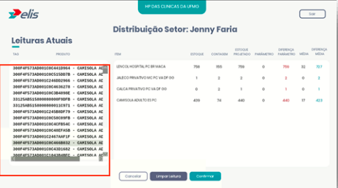
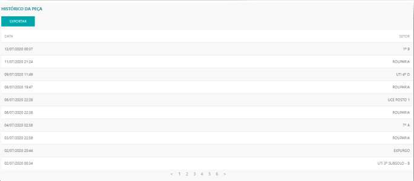

*O Relatório de consulta de peças, apresenta o histórico das movimentações das peças nos setores.*

---
* Para fazer o relatório acesse o site pelo link, entre com o seu usuário e senha de cliente e clique em **ENTRAR**.

* Selecionar o cliente que deseja , clicar em **ACESSAR.**

Site: http://myelis.elisbrasil.com/

---
* O relatório de consulta de peças, apresenta o histórico das movimentações das peças nos setores (Lembrando que só irá aparecer os setores daquele cliente que está logado);

