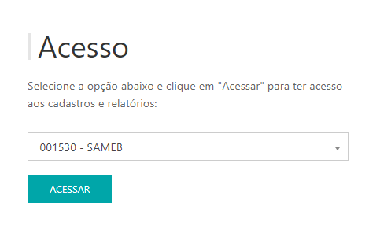

*O Relatório de movimentação de peça, se refere as peças que foram movimentadas para o setor, ou seja, distribuídas pelo totem do cliente.*

---
* Para fazer o relatório acesse o site pelo link, entre com o seu usuário e senha de cliente e clique em **ENTRAR**.

* Selecionar o cliente que deseja , clicar em **ACESSAR.**

Site: http://myelis.elisbrasil.com/

---
* O relatório de movimentação de peça, se refere as peças que foram movimentadas para o setor, ou seja, distribuídas pelo totem do cliente;

*
